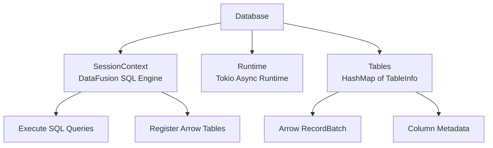
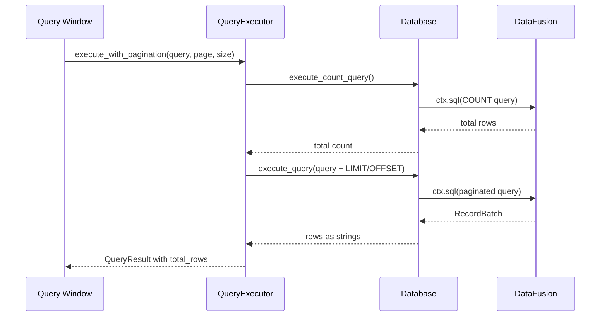
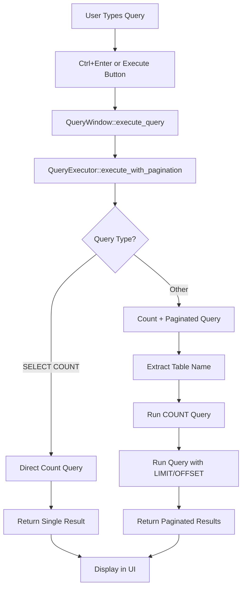
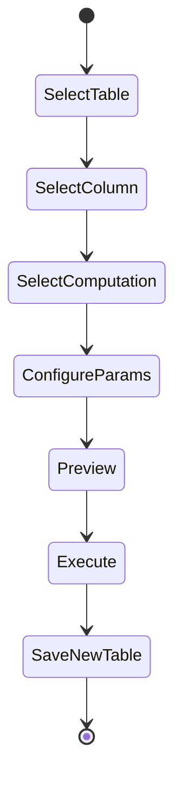
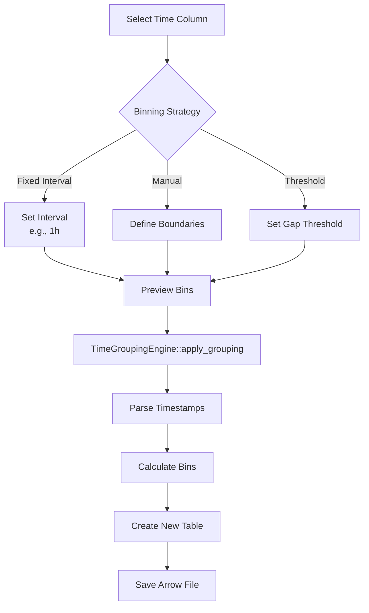
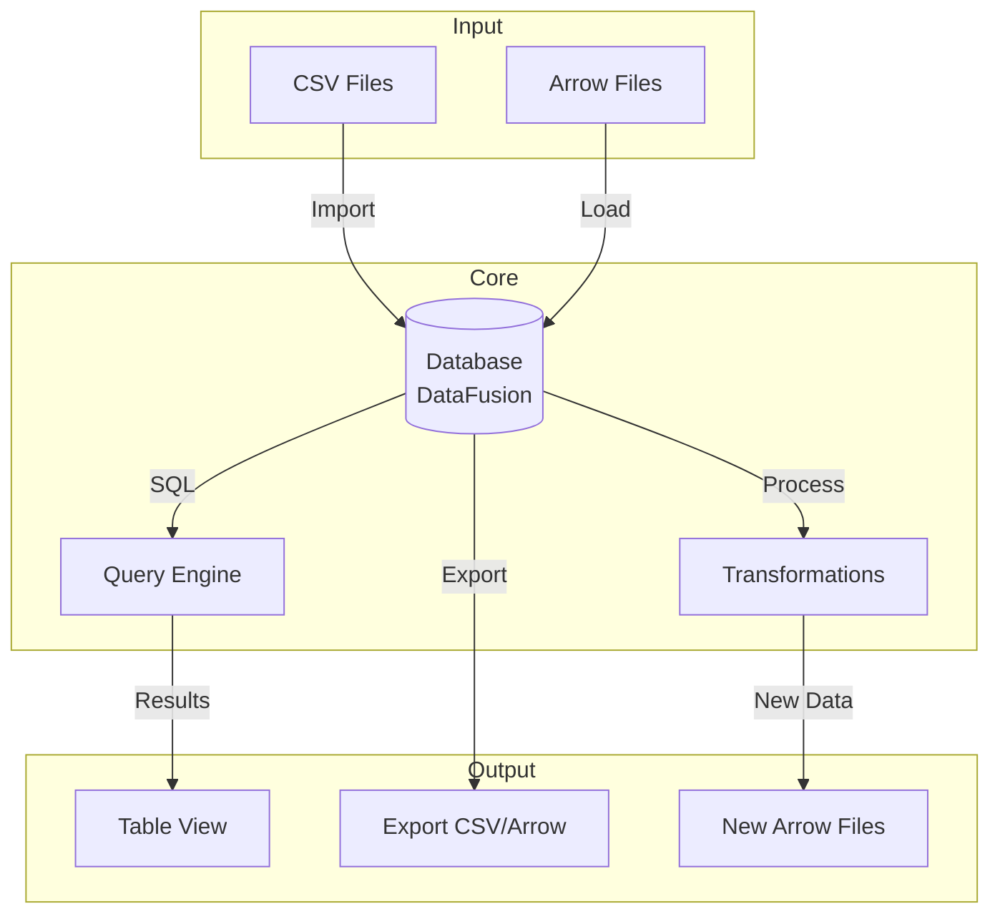
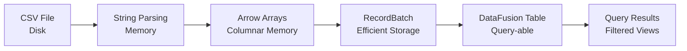
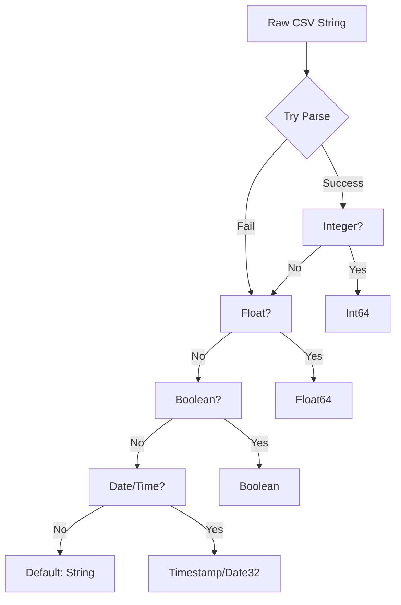

# Leaf Codebase Architecture Overview

This document provides a comprehensive guide to understanding the Leaf application's architecture, file organization, and key workflows.

## Table of Contents

1. [Project Structure](#project-structure)
2. [Core Components](#core-components)
3. [UI Components](#ui-components)
4. [Key Workflows](#key-workflows)
5. [Data Flow Diagrams](#data-flow-diagrams)

## Project Structure

```
leaf/
├── src/
│   ├── main.rs              # Application entry point
│   ├── lib.rs               # Library root
│   ├── app/                 # Application state management
│   │   ├── mod.rs          # App module exports
│   │   └── state.rs        # Main application state (LeafApp)
│   ├── core/               # Core business logic
│   │   ├── mod.rs          # Core module exports
│   │   ├── database.rs     # Database operations & DataFusion integration
│   │   ├── query.rs        # SQL query execution
│   │   ├── transformations.rs    # Data transformation operations
│   │   ├── time_grouping.rs      # Time binning logic
│   │   ├── duplicate_detector.rs # Duplicate detection
│   │   ├── computed_columns_processor.rs  # Computed columns
│   │   ├── enhanced_grouping_processor.rs # Enhanced grouping
│   │   └── error.rs        # Error types
│   ├── ui/                 # User interface components
│   │   ├── mod.rs          # UI module exports
│   │   ├── home_screen.rs  # Main home screen
│   │   ├── sidebar.rs      # Navigation sidebar
│   │   ├── query_window.rs # SQL query interface
│   │   ├── csv_import.rs   # CSV import dialog
│   │   ├── time_bin_dialog.rs     # Time binning UI
│   │   ├── computed_columns.rs    # Computed columns UI
│   │   ├── enhanced_grouping.rs   # Enhanced grouping UI
│   │   └── theme.rs        # UI theme settings
│   └── infer/              # Type inference
│       └── mod.rs          # Type inference logic
├── Cargo.toml              # Rust dependencies
└── test_data/              # Test data files
```

## Core Components

### 1. Database Module (`src/core/database.rs`)

The heart of Leaf's data management, integrating Apache Arrow and DataFusion.



**Key Functions:**
- `open_writable()` / `open_readonly()` - Create database instances
- `stream_insert_csv_with_header_row()` - Import CSV files
- `execute_query()` - Run SQL queries via DataFusion
- `save_table_arrow_ipc()` - Export tables as Arrow files
- `load_table_arrow_ipc()` - Load Arrow files

### 2. Query Executor (`src/core/query.rs`)

Handles SQL query execution with pagination support.



### 3. Application State (`src/app/state.rs`)

Manages the overall application state and UI coordination.

```rust
pub struct LeafApp {
    database: Option<Arc<Database>>,
    home_screen: HomeScreen,
    query_windows: Vec<QueryWindow>,
    // ... other UI components
}
```

## UI Components

### Key UI Dialogs

1. **CSV Import Dialog** (`src/ui/csv_import.rs`)
   - File selection
   - Delimiter detection
   - Type inference options

2. **Time Bin Dialog** (`src/ui/time_bin_dialog.rs`)
   - Column selection
   - Binning strategy (Fixed/Manual/Threshold)
   - Preview functionality

3. **Query Window** (`src/ui/query_window.rs`)
   - SQL editor
   - Results display with pagination
   - Export functionality

## Key Workflows

### 1. CSV Import Workflow


**Code Path:**
1. `src/ui/csv_import.rs` - UI dialog
2. `src/infer/mod.rs` - Type inference
3. `src/core/database.rs::stream_insert_csv_with_header_row()`
4. `src/core/database.rs::string_rows_to_arrow_arrays_with_schema()`
5. DataFusion registration: `ctx.register_batch()`

### 2. Query Execution Workflow



**Files Involved:**
- `src/ui/query_window.rs` - UI handling
- `src/core/query.rs` - Query execution logic
- `src/core/database.rs` - DataFusion integration

### 3. Adding Computed Columns Workflow



**Process Flow:**
1. User opens "Add Computed Columns" dialog
2. Selects source table and column
3. Chooses computation type (Cumulative Sum, Z-Score, etc.)
4. Configures parameters
5. Previews results
6. Executes transformation
7. Creates new Arrow file with added column

**Code Components:**
- `src/ui/computed_columns.rs` - UI dialog
- `src/core/computed_columns_processor.rs` - Processing logic
- `src/core/transformations.rs` - Computation implementations

### 4. Time Binning Workflow



**Implementation Details:**
- `src/ui/time_bin_dialog.rs` - User interface
- `src/core/time_grouping.rs` - Core binning logic
  - `parse_timestamp()` - Handles various time formats
  - `create_fixed_interval_groups()` - Fixed interval binning
  - `create_manual_interval_groups()` - Manual boundaries
  - `create_threshold_based_groups()` - Gap-based binning

## Data Flow Diagrams

### Overall Data Flow



### Memory Management



## Type System

### Data Type Mapping

| CSV/User Type | Arrow Type | Rust Type |
|---------------|------------|-----------|
| Integer | Int64 | i64 |
| Real | Float64 | f64 |
| Text | Utf8 | String |
| Boolean | Boolean | bool |
| Date | Date32 | Days since epoch |
| DateTime | Timestamp(unit) | i64 (unit-based) |
| Time | Utf8 or Timestamp | String or i64 |

### Type Inference Flow



## Error Handling

All errors flow through the `LeafError` type:

```rust
pub enum LeafError {
    Io(std::io::Error),
    Arrow(arrow::error::ArrowError),
    DataFusion(datafusion::error::DataFusionError),
    Custom(String),
}
```

Error propagation uses the `?` operator throughout, with custom errors for user-friendly messages.

## Next Steps

For more detailed information, see:
- [CSV Import Deep Dive](./CSV_IMPORT_WORKFLOW.md)
- [Query Execution Details](./QUERY_EXECUTION.md)
- [Transformation Pipeline](./TRANSFORMATION_PIPELINE.md)
- [UI Component Guide](./UI_COMPONENTS.md)