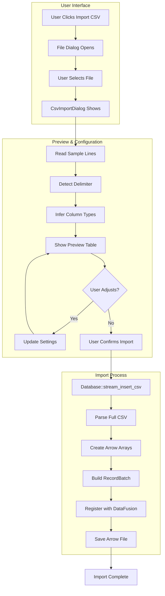
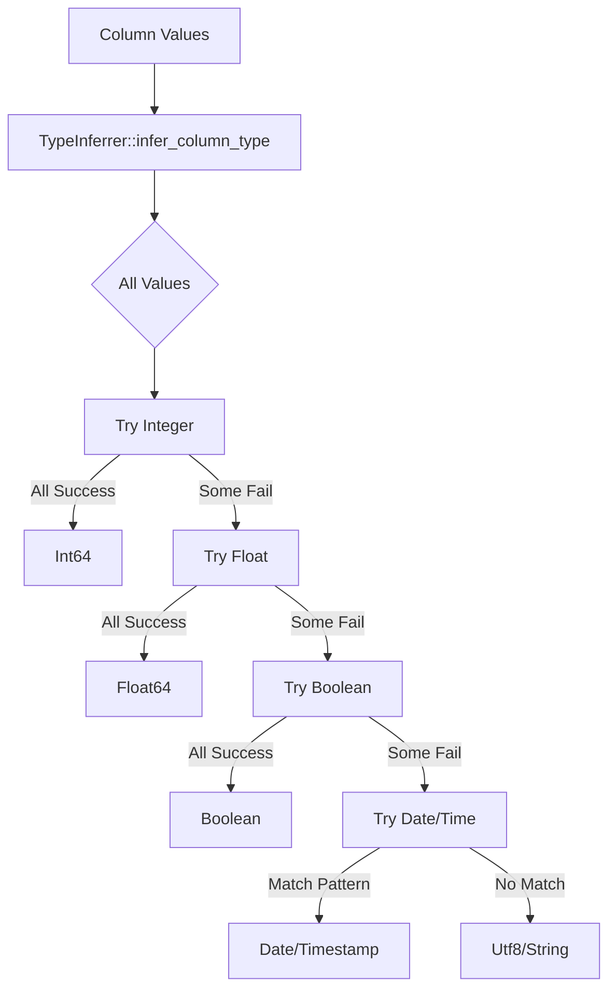
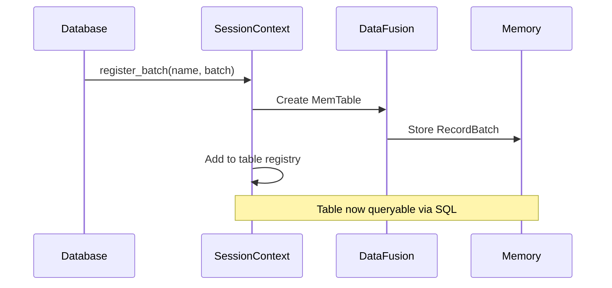

# CSV Import Workflow - Deep Dive

This document details the complete flow of importing a CSV file into Leaf, from file selection to Arrow table creation.

## Overview



## Detailed Code Flow

### 1. UI Initiation (`src/ui/csv_import.rs`)

```rust
// User triggers import from HomeScreen
if ui.button("Import CSV").clicked() {
    if let Some(path) = rfd::FileDialog::new()
        .add_filter("csv", &["csv"])
        .pick_file() 
    {
        csv_import_dialog.open_with_file(path);
    }
}
```

### 2. File Preview (`CsvImportDialog::open_with_file`)

```rust
pub fn open_with_file(&mut self, path: PathBuf) {
    self.file_path = Some(path.clone());
    self.is_open = true;
    
    // Read first 100 lines for preview
    if let Ok(file) = File::open(&path) {
        let reader = BufReader::new(file);
        let mut lines = Vec::new();
        
        for (i, line) in reader.lines().enumerate() {
            if i >= 100 { break; }
            if let Ok(line) = line {
                lines.push(line);
            }
        }
        
        // Detect delimiter
        self.delimiter = self.detect_delimiter(&lines);
        
        // Parse preview data
        self.parse_preview_data(&lines);
    }
}
```

### 3. Type Inference (`src/infer/mod.rs`)



**Type Inference Logic:**

```rust
pub fn infer_column_type(values: &[Option<String>]) -> ColumnType {
    let non_null_values: Vec<&str> = values.iter()
        .filter_map(|v| v.as_ref())
        .map(|s| s.as_str())
        .filter(|s| !s.trim().is_empty())
        .collect();
    
    if non_null_values.is_empty() {
        return ColumnType::Text;
    }
    
    // Check if all values are integers
    if non_null_values.iter().all(|v| v.parse::<i64>().is_ok()) {
        return ColumnType::Integer;
    }
    
    // Check if all values are floats
    if non_null_values.iter().all(|v| v.parse::<f64>().is_ok()) {
        return ColumnType::Real;
    }
    
    // Check for boolean
    if non_null_values.iter().all(|v| {
        matches!(v.to_lowercase().as_str(), 
            "true" | "false" | "yes" | "no" | "1" | "0")
    }) {
        return ColumnType::Boolean;
    }
    
    // Check for dates/times...
    // Default to text
    ColumnType::Text
}
```

### 4. CSV Import Process (`src/core/database.rs`)

#### 4.1 Main Entry Point

```rust
pub fn stream_insert_csv_with_header_row(
    &mut self,
    table_name: &str,
    file_path: &Path,
    delimiter: char,
    header_row: usize,
) -> Result<()> {
    // Open file and create CSV reader
    let file = File::open(file_path)?;
    let mut reader = BufReader::new(file);
    
    // Skip to header row
    for _ in 0..header_row {
        let mut line = String::new();
        reader.read_line(&mut line)?;
    }
    
    // Read header
    let mut header_line = String::new();
    reader.read_line(&mut header_line)?;
    let headers = Self::parse_csv_line(&header_line, delimiter);
    
    // Read all data
    let mut rows = Vec::new();
    for line in reader.lines() {
        let line = line?;
        let row = Self::parse_csv_line(&line, delimiter);
        rows.push(row);
    }
    
    // Infer types
    let column_types = self.infer_column_types(&headers, &rows);
    
    // Create Arrow arrays
    let arrays = self.string_rows_to_arrow_arrays(
        &headers, &rows, &column_types
    )?;
    
    // Create RecordBatch
    let batch = self.create_record_batch(
        &headers, arrays, &column_types
    )?;
    
    // Register with DataFusion
    self.ctx.register_batch(table_name, batch)?;
    
    Ok(())
}
```

#### 4.2 String to Arrow Array Conversion

```rust
fn string_rows_to_arrow_arrays(
    &self,
    columns: &[String],
    values: &[Vec<String>],
    types: &[ColumnType],
) -> Result<Vec<ArrayRef>> {
    let mut arrays = Vec::new();
    
    for (col_idx, col_type) in types.iter().enumerate() {
        let column_values: Vec<Option<String>> = values
            .iter()
            .map(|row| {
                row.get(col_idx)
                    .map(|v| v.clone())
                    .filter(|v| !v.is_empty())
            })
            .collect();
        
        let array: ArrayRef = match col_type {
            ColumnType::Integer => {
                let values: Vec<Option<i64>> = column_values
                    .iter()
                    .map(|v| v.as_ref()?.parse().ok())
                    .collect();
                Arc::new(Int64Array::from(values))
            }
            ColumnType::Real => {
                let values: Vec<Option<f64>> = column_values
                    .iter()
                    .map(|v| v.as_ref()?.parse().ok())
                    .collect();
                Arc::new(Float64Array::from(values))
            }
            ColumnType::Text => {
                Arc::new(StringArray::from(column_values))
            }
            ColumnType::Boolean => {
                let values: Vec<Option<bool>> = column_values
                    .iter()
                    .map(|v| {
                        v.as_ref().map(|s| {
                            matches!(s.to_lowercase().as_str(),
                                "true" | "yes" | "1")
                        })
                    })
                    .collect();
                Arc::new(BooleanArray::from(values))
            }
            // ... other types
        };
        
        arrays.push(array);
    }
    
    Ok(arrays)
}
```

### 5. DataFusion Registration



### 6. Arrow File Persistence

```rust
pub fn save_table_arrow_ipc(
    &self,
    table_name: &str,
    output_path: &Path,
) -> Result<()> {
    // Get the RecordBatch from memory
    let batch = self.get_table_arrow_batch(table_name)?;
    
    // Create Arrow IPC file writer
    let file = File::create(output_path)?;
    let mut writer = FileWriter::try_new(
        file,
        &batch.schema()
    )?;
    
    // Write the batch
    writer.write(&batch)?;
    writer.finish()?;
    
    Ok(())
}
```

## Error Handling

Each step has specific error handling:

```rust
// File errors
if !path.exists() {
    return Err(LeafError::Custom(
        "File does not exist".to_string()
    ));
}

// CSV parsing errors
let row = Self::parse_csv_line(&line, delimiter);
if row.len() != headers.len() {
    return Err(LeafError::Custom(format!(
        "Row has {} columns, expected {}",
        row.len(),
        headers.len()
    )));
}

// Type conversion errors
match value.parse::<i64>() {
    Ok(v) => Some(v),
    Err(_) => {
        // Log warning, use null
        eprintln!("Warning: Could not parse '{}' as integer", value);
        None
    }
}
```

## Performance Considerations

1. **Streaming**: Large files are read line-by-line to avoid loading everything into memory
2. **Batch Processing**: Data is converted to Arrow format in columnar batches
3. **Type Inference Sampling**: Only first N rows are used for type inference
4. **Parallel Processing**: Arrow operations can leverage SIMD instructions

## Configuration Options

The CSV import dialog provides several options:

- **Delimiter**: Auto-detected or manually specified
- **Header Row**: Which row contains column names
- **Null Values**: Strings to interpret as NULL (e.g., "NA", "-", "")
- **Type Overrides**: Manual type specification for columns

## Next Steps

After import, the data is available for:
- [SQL Queries](./QUERY_EXECUTION.md)
- [Transformations](./TRANSFORMATION_PIPELINE.md)
- [Export to Arrow/CSV](./EXPORT_WORKFLOW.md)