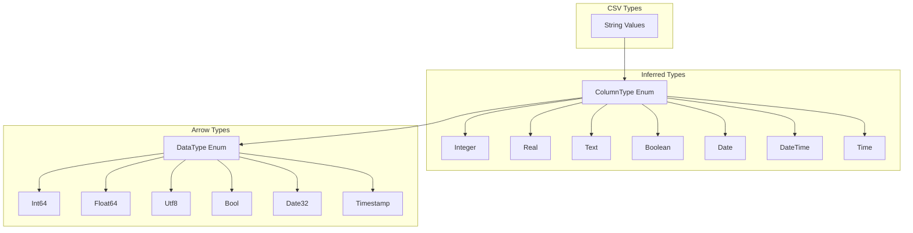
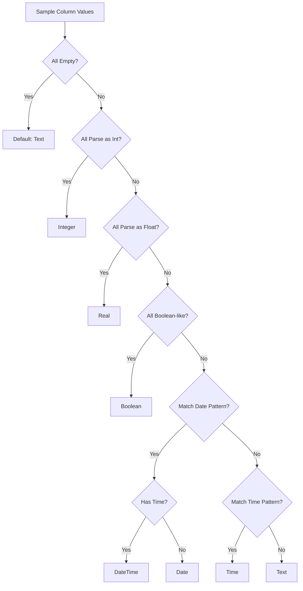
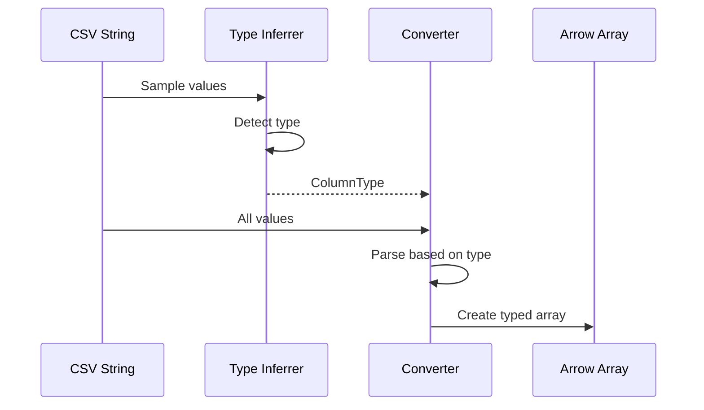
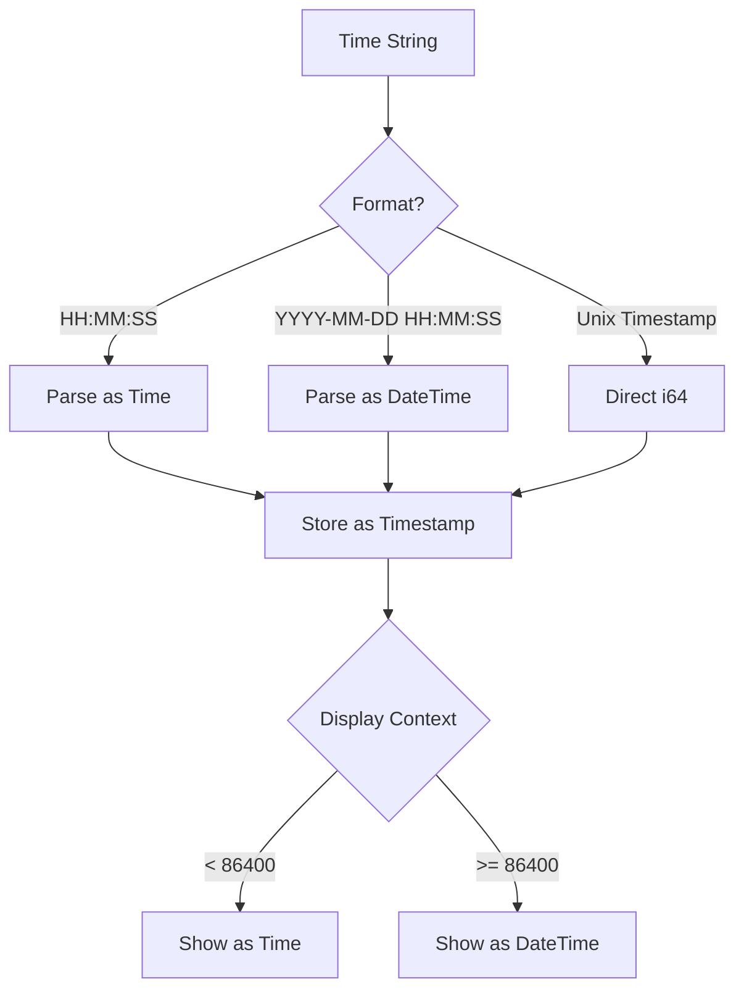

# Data Types and Type Inference in Leaf

This document explains how Leaf handles data types, type inference, and type conversions throughout the application.

## Type System Overview



## Type Inference Process

### 1. Column Type Enum (`src/infer/mod.rs`)

```rust
#[derive(Debug, Clone, PartialEq)]
pub enum ColumnType {
    Integer,
    Real,
    Text,
    Boolean,
    Date,
    DateTime,
    Time,
}
```

### 2. Type Inference Algorithm



### 3. Implementation Details

#### Integer Detection

```rust
fn is_integer_column(values: &[&str]) -> bool {
    values.iter().all(|v| {
        v.parse::<i64>().is_ok() || 
        v.trim().is_empty() ||
        is_null_value(v)
    })
}
```

#### Float Detection

```rust
fn is_float_column(values: &[&str]) -> bool {
    values.iter().all(|v| {
        v.parse::<f64>().is_ok() || 
        v.trim().is_empty() ||
        is_null_value(v)
    })
}
```

#### Boolean Detection

```rust
fn is_boolean_column(values: &[&str]) -> bool {
    values.iter().all(|v| {
        matches!(
            v.to_lowercase().as_str(),
            "true" | "false" | "yes" | "no" | 
            "y" | "n" | "1" | "0" | "t" | "f"
        ) || v.trim().is_empty() || is_null_value(v)
    })
}
```

#### Date/Time Detection

```rust
fn detect_datetime_format(value: &str) -> Option<DateTimeFormat> {
    // ISO 8601
    if ISO_8601_REGEX.is_match(value) {
        return Some(DateTimeFormat::Iso8601);
    }
    
    // Common date formats
    for (regex, format) in DATE_FORMATS.iter() {
        if regex.is_match(value) {
            return Some(format.clone());
        }
    }
    
    // Time only formats
    if TIME_ONLY_REGEX.is_match(value) {
        return Some(DateTimeFormat::TimeOnly);
    }
    
    None
}
```

## Type Conversion Pipeline

### CSV to Arrow Conversion (`src/core/database.rs`)



#### String to Arrow Array

```rust
fn convert_to_arrow_array(
    values: &[Option<String>],
    column_type: &ColumnType,
) -> Result<ArrayRef> {
    match column_type {
        ColumnType::Integer => {
            let parsed: Vec<Option<i64>> = values.iter()
                .map(|v| v.as_ref()?.parse().ok())
                .collect();
            Ok(Arc::new(Int64Array::from(parsed)))
        }
        
        ColumnType::Real => {
            let parsed: Vec<Option<f64>> = values.iter()
                .map(|v| v.as_ref()?.parse().ok())
                .collect();
            Ok(Arc::new(Float64Array::from(parsed)))
        }
        
        ColumnType::Boolean => {
            let parsed: Vec<Option<bool>> = values.iter()
                .map(|v| {
                    v.as_ref().map(|s| {
                        matches!(s.to_lowercase().as_str(),
                            "true" | "yes" | "1" | "t" | "y")
                    })
                })
                .collect();
            Ok(Arc::new(BooleanArray::from(parsed)))
        }
        
        ColumnType::DateTime => {
            let parsed = parse_datetime_values(values)?;
            Ok(Arc::new(TimestampMillisecondArray::from(parsed)))
        }
        
        // ... other types
    }
}
```

## Special Type Handling

### 1. Time Types

Leaf handles time data in multiple ways:



#### Time Parsing Implementation

```rust
fn parse_time_string_to_timestamp(
    time_str: &str,
    unit: &TimeUnit
) -> Option<i64> {
    // Try HH:MM:SS.mmm format
    if let Ok(time) = NaiveTime::parse_from_str(time_str, "%H:%M:%S%.3f") {
        let nanos = time.num_seconds_from_midnight() as i64 * 1_000_000_000
            + time.nanosecond() as i64;
        
        return Some(match unit {
            TimeUnit::Second => nanos / 1_000_000_000,
            TimeUnit::Millisecond => nanos / 1_000_000,
            TimeUnit::Microsecond => nanos / 1_000,
            TimeUnit::Nanosecond => nanos,
        });
    }
    
    // Try other formats...
    None
}
```

### 2. Null Value Handling

```rust
fn is_null_value(value: &str) -> bool {
    matches!(
        value.trim().to_lowercase().as_str(),
        "" | "null" | "na" | "n/a" | "-" | "none" | "nil"
    )
}

// In conversion
if is_null_value(value) {
    None
} else {
    Some(parse_value(value)?)
}
```

### 3. Special Numeric Values

```rust
fn parse_float_special(value: &str) -> Option<f64> {
    match value.to_lowercase().as_str() {
        "inf" | "infinity" => Some(f64::INFINITY),
        "-inf" | "-infinity" => Some(f64::NEG_INFINITY),
        "nan" => Some(f64::NAN),
        _ => value.parse().ok(),
    }
}
```

## Type Display and Formatting

### Arrow to String Conversion

```rust
fn array_value_to_string(
    array: &ArrayRef,
    index: usize,
    data_type: &DataType,
) -> Result<String> {
    if array.is_null(index) {
        return Ok("NULL".to_string());
    }
    
    match data_type {
        DataType::Int64 => {
            let array = array.as_any()
                .downcast_ref::<Int64Array>()
                .unwrap();
            Ok(array.value(index).to_string())
        }
        
        DataType::Float64 => {
            let array = array.as_any()
                .downcast_ref::<Float64Array>()
                .unwrap();
            let value = array.value(index);
            
            // Format with appropriate precision
            if value.fract() == 0.0 {
                Ok(format!("{:.0}", value))
            } else {
                Ok(format!("{:.6}", value).trim_end_matches('0').trim_end_matches('.').to_string())
            }
        }
        
        DataType::Timestamp(unit, _) => {
            format_timestamp(array, index, unit)
        }
        
        // ... other types
    }
}
```

### Timestamp Formatting

```rust
fn format_timestamp(
    array: &ArrayRef,
    index: usize,
    unit: &TimeUnit,
) -> Result<String> {
    let timestamp = get_timestamp_value(array, index, unit)?;
    
    // Check if this is time-of-day or full datetime
    if timestamp < 86400 {
        // Format as time
        let hours = (timestamp / 3600) % 24;
        let minutes = (timestamp / 60) % 60;
        let seconds = timestamp % 60;
        Ok(format!("{:02}:{:02}:{:02}", hours, minutes, seconds))
    } else {
        // Format as datetime
        let datetime = DateTime::from_timestamp(timestamp, 0)
            .unwrap_or_default();
        Ok(datetime.format("%Y-%m-%d %H:%M:%S").to_string())
    }
}
```

## Type Validation

### Schema Validation

```rust
fn validate_schema_compatibility(
    source_schema: &Schema,
    target_schema: &Schema,
) -> Result<()> {
    for (source_field, target_field) in source_schema.fields().iter()
        .zip(target_schema.fields().iter()) 
    {
        if !is_compatible_type(source_field.data_type(), target_field.data_type()) {
            return Err(LeafError::Custom(format!(
                "Incompatible types for column '{}': {:?} vs {:?}",
                source_field.name(),
                source_field.data_type(),
                target_field.data_type()
            )));
        }
    }
    Ok(())
}
```

### Type Compatibility

```rust
fn is_compatible_type(source: &DataType, target: &DataType) -> bool {
    match (source, target) {
        // Same type
        (a, b) if a == b => true,
        
        // Numeric promotion
        (DataType::Int64, DataType::Float64) => true,
        (DataType::Int32, DataType::Int64) => true,
        
        // String compatibility
        (_, DataType::Utf8) => true, // Anything can be string
        
        // Timestamp compatibility
        (DataType::Timestamp(_, _), DataType::Timestamp(_, _)) => true,
        
        _ => false,
    }
}
```

## Best Practices

1. **Conservative Inference**: When unsure, default to string type
2. **Null Handling**: Always handle null/empty values gracefully
3. **Type Preservation**: Maintain types through transformations
4. **User Override**: Allow manual type specification
5. **Error Messages**: Provide clear type mismatch errors
6. **Performance**: Use Arrow's native types for efficiency