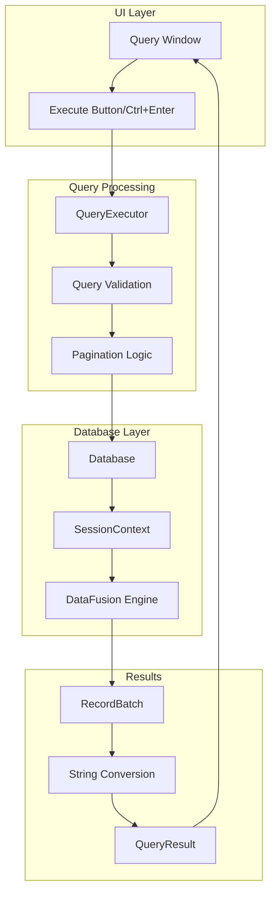
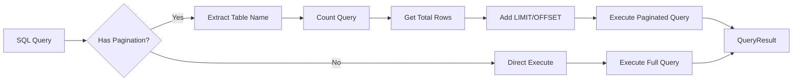
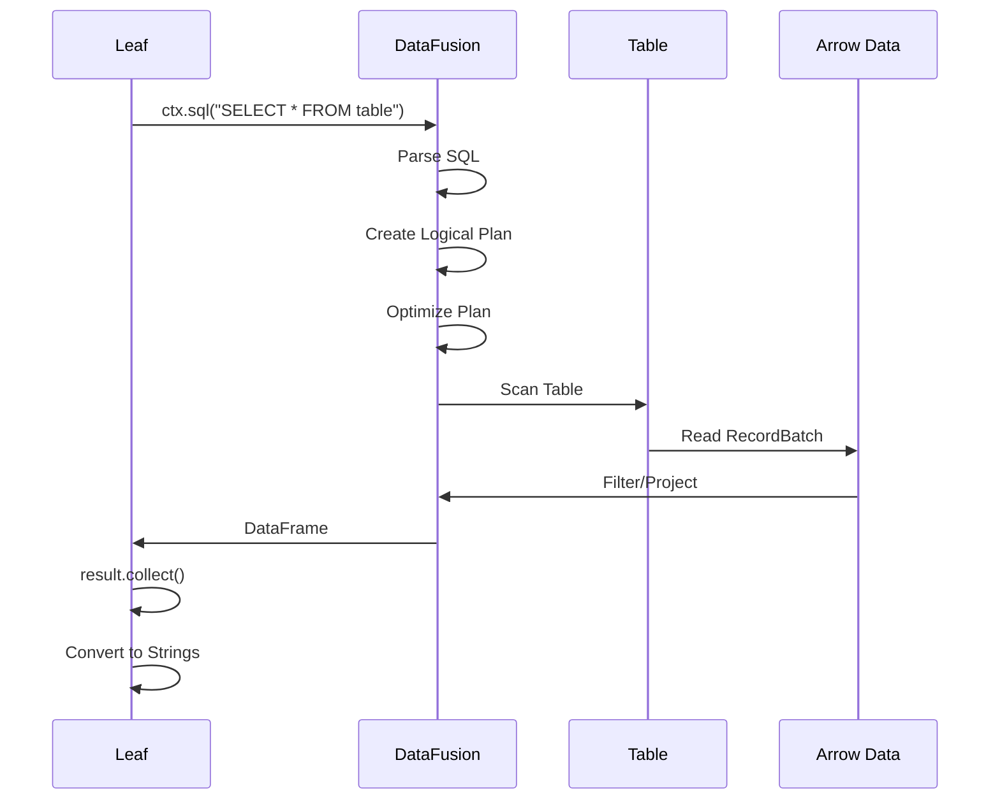
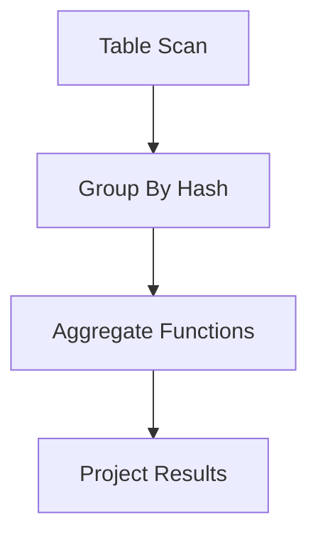

# Query Execution in Leaf

This document explains how SQL queries are executed in Leaf, from the UI to DataFusion and back.

## High-Level Architecture



## Detailed Flow

### 1. Query Window UI (`src/ui/query_window.rs`)

The query window provides a text editor for SQL queries:

```rust
pub struct QueryWindow {
    id: Id,
    title: String,
    query: String,              // SQL query text
    result: Option<QueryResult>, // Query results
    error: Option<String>,      // Error messages
    page: usize,               // Current page
    page_size: usize,          // Rows per page
    is_open: bool,
}
```

**Query Execution Trigger:**

```rust
// Handle Ctrl+Enter
if response.response.has_focus() 
    && ui.input(|i| i.key_pressed(egui::Key::Enter) && i.modifiers.ctrl) {
    self.page = 0;  // Reset to first page for new query
    self.execute_query(db.clone());
    ui.ctx().request_repaint();
}

// Or Execute button
if ui.button("Execute Query").clicked() {
    self.page = 0;
    self.execute_query(db.clone());
    ui.ctx().request_repaint();
}
```

### 2. Query Executor (`src/core/query.rs`)

The QueryExecutor handles pagination and query processing:



**Pagination Logic:**

```rust
pub fn execute_with_pagination(
    db: &Arc<Database>,
    query: &str,
    page: usize,
    page_size: usize,
) -> Result<QueryResult> {
    // Special handling for COUNT queries
    if query.trim().to_uppercase().starts_with("SELECT COUNT(*)") {
        let count = db.execute_count_query(query)?;
        return Ok(QueryResult {
            columns: vec!["COUNT(*)".to_string()],
            column_types: vec![DataType::Int64],
            rows: vec![vec![count.to_string()]],
            total_rows: Some(1),
        });
    }
    
    // Get total count for pagination
    let count_query = build_count_query(query);
    let total_rows = db.execute_count_query(&count_query)? as usize;
    
    // Execute paginated query
    let paginated_query = format!(
        "{} LIMIT {} OFFSET {}", 
        query, 
        page_size, 
        page * page_size
    );
    
    let mut result = Self::execute(db, &paginated_query)?;
    result.total_rows = Some(total_rows);
    
    Ok(result)
}
```

### 3. Database Query Execution (`src/core/database.rs`)

The Database integrates with DataFusion for SQL execution:

```rust
pub fn execute_query_batch(&self, query: &str) -> Result<DataBatch> {
    let ctx = self.ctx.clone();
    
    // Execute SQL asynchronously
    let result = self.runtime.block_on(async {
        ctx.sql(query).await
    }).map_err(|e| LeafError::Custom(
        format!("Failed to execute query: {}", e)
    ))?;
    
    // Collect results
    let record_batches = self.runtime.block_on(async {
        result.collect().await
    }).map_err(|e| LeafError::Custom(
        format!("Failed to collect results: {}", e)
    ))?;
    
    if record_batches.is_empty() {
        return Ok(DataBatch {
            columns: vec![],
            rows: vec![],
        });
    }
    
    // Convert to string representation
    let batch = &record_batches[0];
    let columns = extract_column_names(&batch);
    let rows = self.record_batch_to_rows(batch)?;
    
    Ok(DataBatch { columns, rows })
}
```

### 4. DataFusion Integration



### 5. Result Conversion (`record_batch_to_rows`)

Arrow data is converted to strings for display:

```rust
fn record_batch_to_rows(&self, batch: &RecordBatch) -> Result<Vec<Vec<String>>> {
    let mut rows = Vec::new();
    let num_rows = batch.num_rows();
    
    for row_idx in 0..num_rows {
        let mut row = Vec::new();
        
        for col_idx in 0..batch.num_columns() {
            let array = batch.column(col_idx);
            let value = self.array_value_to_string(
                array, 
                row_idx,
                batch.schema().field(col_idx).data_type()
            )?;
            row.push(value);
        }
        
        rows.push(row);
    }
    
    Ok(rows)
}
```

## Query Types and Optimization

### 1. Simple SELECT Queries

```sql
SELECT * FROM table_name
```

**Optimization**: Direct table scan with optional LIMIT

### 2. Filtered Queries

```sql
SELECT * FROM table WHERE column = 'value'
```

**Processing**:
1. DataFusion creates a filter node
2. Predicate pushdown optimization
3. Only matching rows are materialized

### 3. Aggregation Queries

```sql
SELECT category, COUNT(*), AVG(value) 
FROM table 
GROUP BY category
```

**Execution Plan**:


### 4. Join Queries

```sql
SELECT a.*, b.name 
FROM table_a a 
JOIN table_b b ON a.id = b.id
```

**Join Strategy**: DataFusion automatically selects:
- Hash Join (for large tables)
- Sort-Merge Join (for sorted data)
- Nested Loop Join (for small tables)

## Error Handling

### Query Validation

```rust
pub fn validate_read_only(query: &str) -> Result<()> {
    let query_upper = query.to_uppercase();
    let forbidden = [
        "INSERT", "UPDATE", "DELETE", "DROP", 
        "CREATE", "ALTER", "TRUNCATE"
    ];
    
    for keyword in &forbidden {
        if query_upper.contains(keyword) {
            return Err(LeafError::Custom(format!(
                "Query contains forbidden keyword '{}' in read-only mode", 
                keyword
            )));
        }
    }
    Ok(())
}
```

### Common Errors

1. **Syntax Errors**
   ```
   SQL error: ParserError("Expected end of statement, found: LIMIT")
   ```

2. **Table Not Found**
   ```
   Table 'nonexistent_table' does not exist
   ```

3. **Column Not Found**
   ```
   Schema error: No field named column_name
   ```

4. **Type Mismatch**
   ```
   Cannot compare string with number
   ```

## Performance Considerations

### 1. Query Planning

DataFusion creates an optimized query plan:

```
Projection: table.col1, table.col2
  Filter: table.col3 > 100
    TableScan: table projection=[col1, col2, col3]
```

### 2. Memory Management

- Results are streamed in batches
- Large result sets are paginated
- Arrow columnar format minimizes memory overhead

### 3. Indexing

Currently, Leaf relies on DataFusion's in-memory scanning. Future optimizations could include:
- Sorted columns for faster range queries
- Hash indices for equality filters
- Statistics for query planning

## SQL Dialect

Leaf uses DataFusion's SQL parser, which supports:

- **Standard SQL**: SELECT, WHERE, GROUP BY, ORDER BY, LIMIT
- **Joins**: INNER, LEFT, RIGHT, FULL OUTER
- **Aggregates**: COUNT, SUM, AVG, MIN, MAX
- **Window Functions**: ROW_NUMBER(), RANK(), etc.
- **CTEs**: WITH clauses
- **Subqueries**: In SELECT, FROM, and WHERE

## Examples

### Basic Queries

```sql
-- Select all
SELECT * FROM test_data_300k

-- With filter
SELECT * FROM test_data_300k WHERE width > 100

-- With multiple conditions
SELECT * FROM test_data_300k 
WHERE category_3 = 'A' AND isGood = true

-- Ordering
SELECT * FROM test_data_300k 
ORDER BY good_time DESC 
LIMIT 100
```

### Aggregations

```sql
-- Count by category
SELECT category_3, COUNT(*) as count 
FROM test_data_300k 
GROUP BY category_3 
ORDER BY count DESC

-- Statistics
SELECT 
    MIN(width) as min_width,
    MAX(width) as max_width,
    AVG(width) as avg_width,
    STDDEV(width) as std_width
FROM test_data_300k
```

### Complex Queries

```sql
-- Time-based analysis
SELECT 
    EXTRACT(HOUR FROM good_time) as hour,
    COUNT(*) as count,
    AVG(width) as avg_width
FROM test_data_300k
GROUP BY hour
ORDER BY hour

-- Conditional aggregation
SELECT 
    category_3,
    COUNT(*) as total,
    SUM(CASE WHEN isGood THEN 1 ELSE 0 END) as good_count,
    AVG(CASE WHEN isGood THEN width END) as avg_good_width
FROM test_data_300k
GROUP BY category_3
```