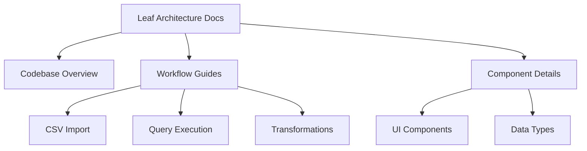
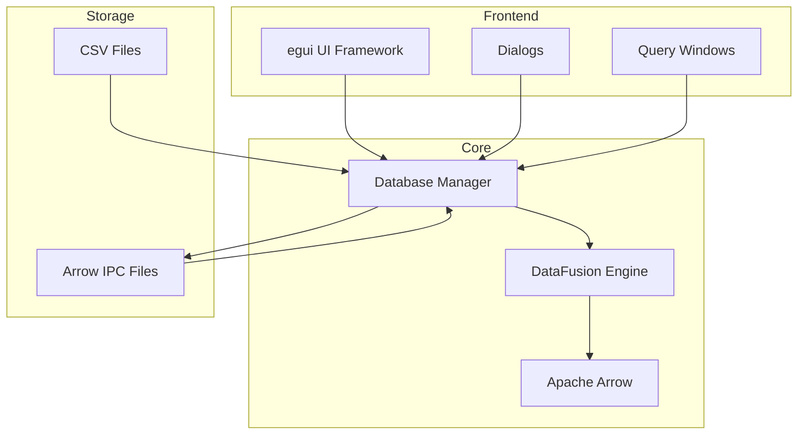

# Leaf Architecture Documentation

Welcome to the comprehensive architecture documentation for Leaf - a data analysis application built with Rust, Apache Arrow, and DataFusion.

## 📚 Documentation Structure



## 🗂️ Documentation Index

### 1. [Codebase Overview](./CODEBASE_OVERVIEW.md)
**Start Here!** - High-level overview of the entire codebase
- Project structure and file organization
- Core components and their responsibilities
- Key workflows and data flow
- Architecture diagrams

### 2. [CSV Import Workflow](./CSV_IMPORT_WORKFLOW.md)
Deep dive into how CSV files are imported
- File reading and parsing
- Type inference process
- Arrow array creation
- DataFusion table registration
- Error handling

### 3. [Query Execution](./QUERY_EXECUTION.md)
Complete guide to SQL query processing
- Query window UI
- DataFusion integration
- Pagination implementation
- Result formatting
- Performance considerations

### 4. [Transformation Pipeline](./TRANSFORMATION_PIPELINE.md)
How data transformations work
- Time binning strategies
- Computed columns (cumulative sum, z-score, etc.)
- Enhanced grouping with rules
- Non-destructive transformations

### 5. [UI Components Guide](./UI_COMPONENTS.md)
Understanding the user interface
- Application state management
- Dialog patterns
- Event handling
- Theme and styling
- Best practices

### 6. [Data Types and Inference](./DATA_TYPES_AND_INFERENCE.md)
Type system and inference logic
- CSV to Arrow type mapping
- Type inference algorithm
- Special handling (dates, times, nulls)
- Type validation and compatibility

## 🏗️ System Architecture



## 🔄 Key Workflows

### Data Import Flow
```
CSV File → Type Inference → Arrow Arrays → DataFusion Table → Arrow IPC File
```

### Query Flow
```
SQL Query → Parse & Validate → DataFusion Execute → RecordBatch → String Format → UI Display
```

### Transformation Flow
```
Source Table → Apply Transformation → New Column → New Table → Save Arrow File
```

## 📦 Technology Stack

- **Language**: Rust
- **UI Framework**: egui (immediate mode GUI)
- **Data Processing**: Apache Arrow
- **Query Engine**: DataFusion
- **File Formats**: CSV, Arrow IPC
- **Async Runtime**: Tokio

## 🚀 Getting Started

1. Start with the [Codebase Overview](./CODEBASE_OVERVIEW.md) to understand the structure
2. Follow specific workflow guides based on what you're working on
3. Reference component guides for detailed implementation information

## 📝 Code Examples

### Opening a Database
```rust
let db = Database::open_writable(".")?;
let db_arc = Arc::new(db);
```

### Importing CSV
```rust
db.stream_insert_csv_with_header_row(
    "table_name",
    Path::new("data.csv"),
    ',',  // delimiter
    0     // header row
)?;
```

### Executing a Query
```rust
let result = QueryExecutor::execute_with_pagination(
    &db_arc,
    "SELECT * FROM table_name",
    0,    // page
    100   // page size
)?;
```

### Adding a Computed Column
```rust
let config = ComputedColumnConfig {
    source_table: "table_name".to_string(),
    source_column: "value".to_string(),
    computation_type: ComputationType::CumulativeSum,
    output_column_name: "cumsum".to_string(),
};

ComputedColumnsProcessor::apply_computation(&db, &config)?;
```

## 🔍 Finding Your Way

- **Working on UI?** → Start with [UI Components Guide](./UI_COMPONENTS.md)
- **Adding a feature?** → Check relevant workflow guide
- **Debugging types?** → See [Data Types and Inference](./DATA_TYPES_AND_INFERENCE.md)
- **Understanding data flow?** → Read [Codebase Overview](./CODEBASE_OVERVIEW.md)

## 🤝 Contributing

When adding new features:
1. Update relevant documentation
2. Follow existing patterns
3. Add error handling
4. Consider performance implications
5. Test with various data types

---

*This documentation is part of the Leaf project. For the latest updates, see the [GitHub repository](https://github.com/Anthonymm0994/leaf).*