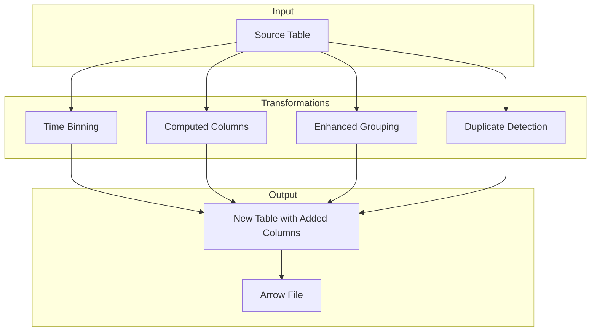
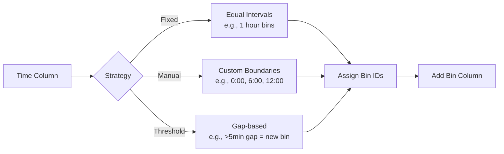
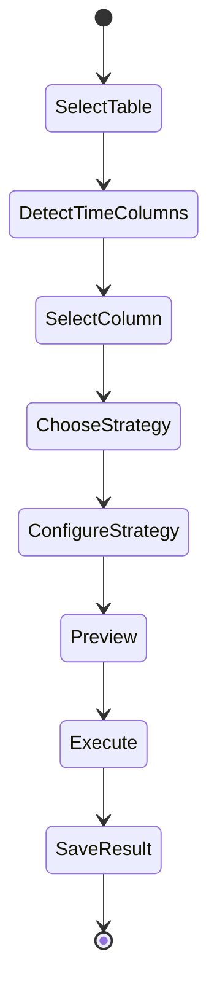
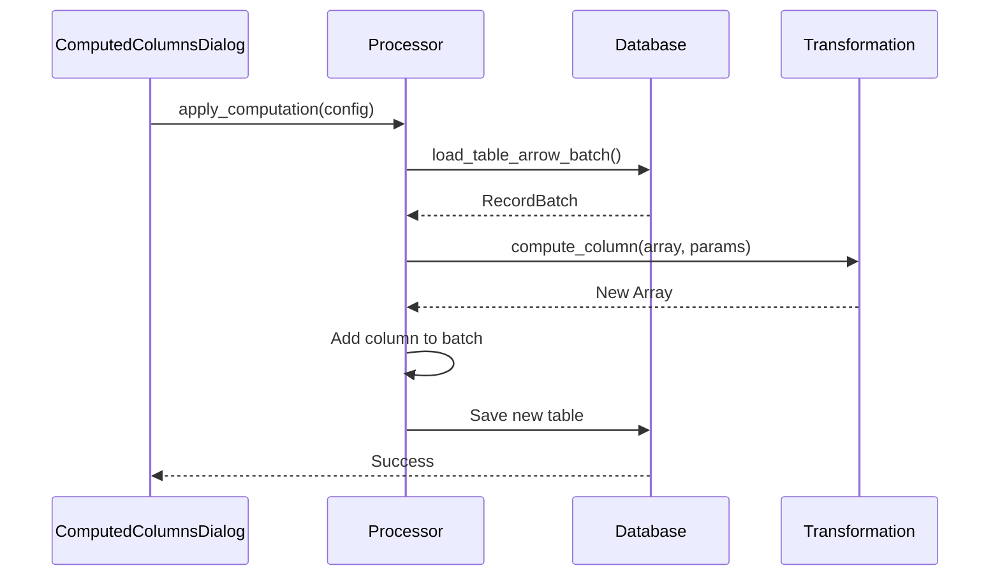
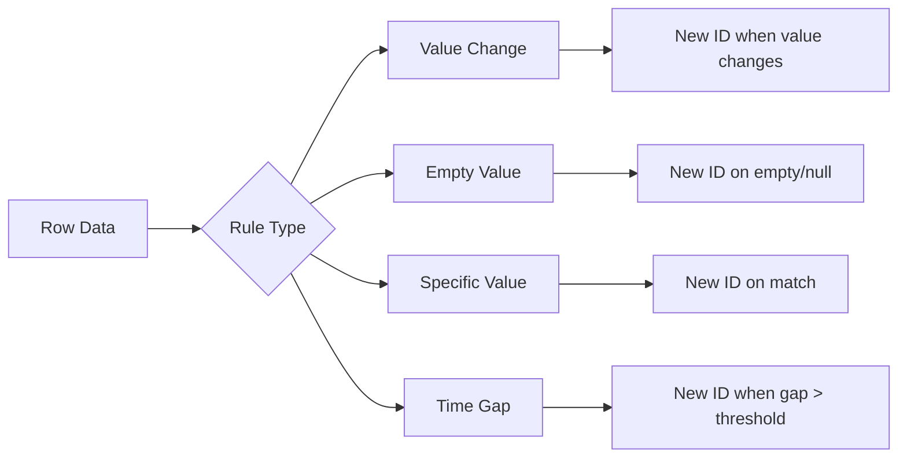
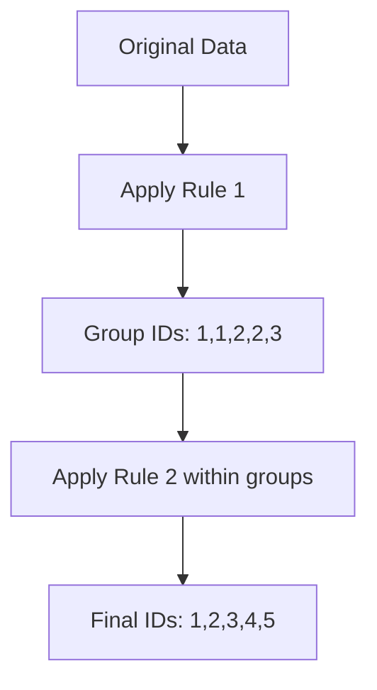

# Transformation Pipeline in Leaf

This document details how data transformations work in Leaf, including time binning, computed columns, and enhanced grouping.

## Overview of Transformations



## 1. Time Binning

### Overview

Time binning groups time-series data into intervals (bins) for analysis.



### Implementation (`src/core/time_grouping.rs`)

#### Fixed Interval Binning

```rust
fn create_fixed_interval_groups(
    rows: &[Vec<String>],
    time_column_idx: usize,
    interval_seconds: u64,
    groups: &mut Vec<i64>,
) -> Result<()> {
    // Find min timestamp for relative binning
    let mut min_timestamp = i64::MAX;
    for row in rows {
        let time_str = &row[time_column_idx];
        if !time_str.trim().is_empty() {
            if let Ok(timestamp) = Self::parse_timestamp(time_str) {
                min_timestamp = min_timestamp.min(timestamp);
            }
        }
    }
    
    // Assign bins relative to minimum
    for row in rows {
        let time_str = &row[time_column_idx];
        
        if time_str.trim().is_empty() {
            groups.push(-1); // Special bin for nulls
            continue;
        }
        
        let timestamp = Self::parse_timestamp(time_str)?;
        let offset_from_min = timestamp - min_timestamp;
        let bin = offset_from_min / (interval_seconds as i64);
        groups.push(bin);
    }
    
    Ok(())
}
```

#### Time Parsing

```rust
fn parse_timestamp(time_str: &str) -> Result<i64> {
    // Try Unix timestamp
    if let Ok(timestamp) = time_str.parse::<i64>() {
        return Ok(timestamp);
    }
    
    // Try various time formats
    let formats = [
        "%Y-%m-%d %H:%M:%S%.f",  // Full datetime with fraction
        "%Y-%m-%d %H:%M:%S",     // Full datetime
        "%H:%M:%S%.f",           // Time with milliseconds
        "%H:%M:%S",              // Time only
        "%H:%M",                 // Hours and minutes
    ];
    
    for format in &formats {
        if let Ok(datetime) = NaiveDateTime::parse_from_str(time_str, format) {
            return Ok(datetime.and_utc().timestamp());
        }
    }
    
    // Try time-only format (assume today's date)
    if let Ok(time) = NaiveTime::parse_from_str(time_str, "%H:%M:%S%.f") {
        let today = Utc::now().date_naive();
        let datetime = today.and_time(time);
        return Ok(datetime.and_utc().timestamp());
    }
    
    Err(LeafError::Custom(format!("Unable to parse timestamp: '{}'", time_str)))
}
```

### UI Flow (`src/ui/time_bin_dialog.rs`)



## 2. Computed Columns

### Available Computations

```mermaid
graph TD
    A[Source Column] --> B{Computation Type}
    
    B --> C[Cumulative Sum]
    B --> D[Percentage of Total]
    B --> E[Ratio Between Columns]
    B --> F[Moving Average]
    B --> G[Z-Score]
    
    C --> H[Running Total]
    D --> I[Value / Sum * 100]
    E --> J[Col1 / Col2]
    F --> K[Window Average]
    G --> L[(Value - Mean) / StdDev]
```

### Implementation (`src/core/computed_columns_processor.rs`)

#### Cumulative Sum

```rust
fn compute_cumulative_sum(array: &Float64Array) -> Result<Float64Array> {
    let mut cumsum = 0.0;
    let mut result = Vec::with_capacity(array.len());
    
    for i in 0..array.len() {
        if array.is_null(i) {
            result.push(None);
        } else {
            cumsum += array.value(i);
            result.push(Some(cumsum));
        }
    }
    
    Ok(Float64Array::from(result))
}
```

#### Z-Score Calculation

```rust
fn compute_z_score(array: &Float64Array) -> Result<Float64Array> {
    // Calculate mean
    let (sum, count) = array.iter()
        .filter_map(|v| v)
        .fold((0.0, 0), |(s, c), v| (s + v, c + 1));
    
    let mean = sum / count as f64;
    
    // Calculate standard deviation
    let variance = array.iter()
        .filter_map(|v| v)
        .map(|v| (v - mean).powi(2))
        .sum::<f64>() / count as f64;
    
    let std_dev = variance.sqrt();
    
    // Calculate Z-scores
    let result: Vec<Option<f64>> = array.iter()
        .map(|v| {
            v.map(|value| (value - mean) / std_dev)
        })
        .collect();
    
    Ok(Float64Array::from(result))
}
```

### Processing Pipeline



## 3. Enhanced Grouping

### Rule Types



### Implementation (`src/core/enhanced_grouping_processor.rs`)

#### Value Change Detection

```rust
fn apply_value_change_rule(
    array: &dyn Array,
    current_ids: &mut Vec<i64>,
    next_id: &mut i64,
) -> Result<()> {
    if array.len() == 0 {
        return Ok(());
    }
    
    // Initialize first row
    current_ids[0] = *next_id;
    
    // Process remaining rows
    for i in 1..array.len() {
        let current_value = get_value_as_string(array, i)?;
        let previous_value = get_value_as_string(array, i - 1)?;
        
        if current_value != previous_value {
            *next_id += 1;
        }
        
        current_ids[i] = *next_id;
    }
    
    Ok(())
}
```

#### Time Gap Detection

```rust
fn apply_time_gap_rule(
    array: &dyn Array,
    threshold_seconds: i64,
    current_ids: &mut Vec<i64>,
    next_id: &mut i64,
) -> Result<()> {
    // Handle different timestamp types
    match array.data_type() {
        DataType::Timestamp(unit, _) => {
            let timestamps = extract_timestamps(array, unit)?;
            
            for i in 1..timestamps.len() {
                let gap = timestamps[i] - timestamps[i - 1];
                
                if gap > threshold_seconds {
                    *next_id += 1;
                }
                
                current_ids[i] = *next_id;
            }
        }
        _ => return Err(LeafError::Custom(
            "Time gap rule requires timestamp column".to_string()
        )),
    }
    
    Ok(())
}
```

### Hierarchical Grouping

Multiple rules can be applied in sequence:



## 4. Transformation Output

### Creating New Tables

All transformations follow this pattern:

```rust
fn save_transformation_result(
    &self,
    original_batch: RecordBatch,
    new_column_name: &str,
    new_column_data: ArrayRef,
    output_table_name: &str,
) -> Result<()> {
    // Create new schema with added column
    let mut fields = original_batch.schema().fields().to_vec();
    fields.push(Field::new(
        new_column_name,
        new_column_data.data_type().clone(),
        true
    ));
    let new_schema = Arc::new(Schema::new(fields));
    
    // Create new RecordBatch
    let mut columns = original_batch.columns().to_vec();
    columns.push(new_column_data);
    let new_batch = RecordBatch::try_new(new_schema, columns)?;
    
    // Save to Arrow file
    let output_path = format!("{}.arrow", output_table_name);
    let file = File::create(&output_path)?;
    let mut writer = FileWriter::try_new(file, &new_batch.schema())?;
    writer.write(&new_batch)?;
    writer.finish()?;
    
    Ok(())
}
```

## Performance Optimization

### 1. Columnar Processing

Arrow's columnar format enables:
- SIMD operations
- Cache-efficient processing
- Minimal memory allocation

### 2. Lazy Evaluation

Transformations are applied only when needed:
```rust
// Preview uses only first N rows
let preview_batch = batch.slice(0, 100);
```

### 3. Memory Management

```rust
// Process in chunks for large datasets
const CHUNK_SIZE: usize = 10000;

for chunk_start in (0..total_rows).step_by(CHUNK_SIZE) {
    let chunk_end = (chunk_start + CHUNK_SIZE).min(total_rows);
    let chunk = batch.slice(chunk_start, chunk_end - chunk_start);
    
    // Process chunk
    process_chunk(&chunk)?;
}
```

## Error Handling

Each transformation validates inputs:

```rust
// Type validation
if !matches!(column_type, DataType::Float64 | DataType::Int64) {
    return Err(LeafError::Custom(
        "Numeric column required for this operation".to_string()
    ));
}

// Null handling
if array.null_count() == array.len() {
    return Err(LeafError::Custom(
        "Cannot compute on column with all null values".to_string()
    ));
}

// Division by zero
if denominator.abs() < f64::EPSILON {
    return Ok(None); // Return null for division by zero
}
```

## Best Practices

1. **Non-Destructive**: Always create new tables, never modify originals
2. **Preserve Types**: Maintain data types unless transformation requires change
3. **Handle Nulls**: Propagate nulls appropriately through computations
4. **Document Output**: Include metadata about transformations applied
5. **Validate Results**: Provide preview before committing transformations