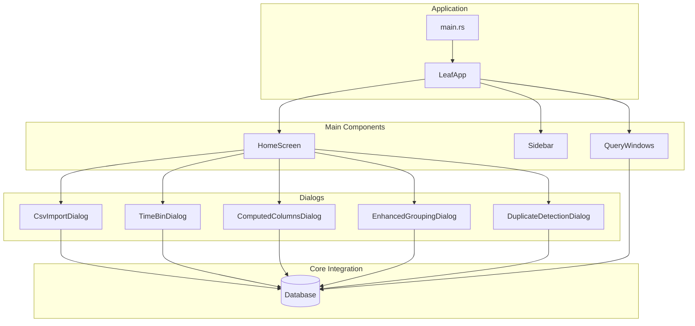
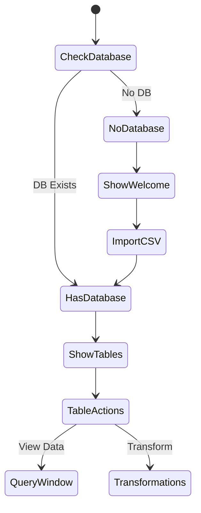
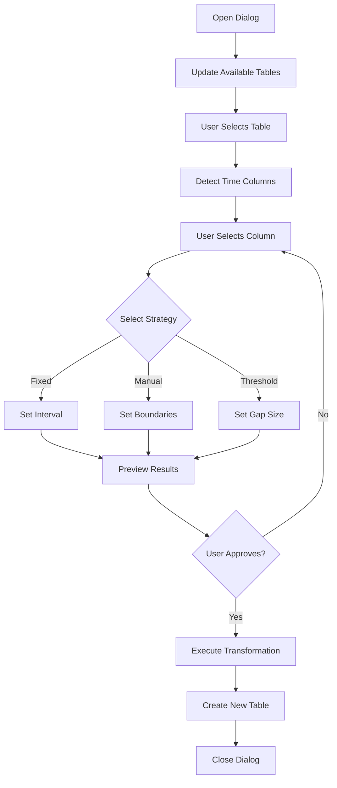
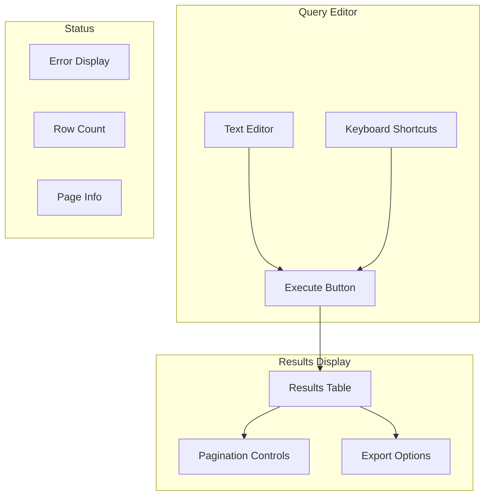
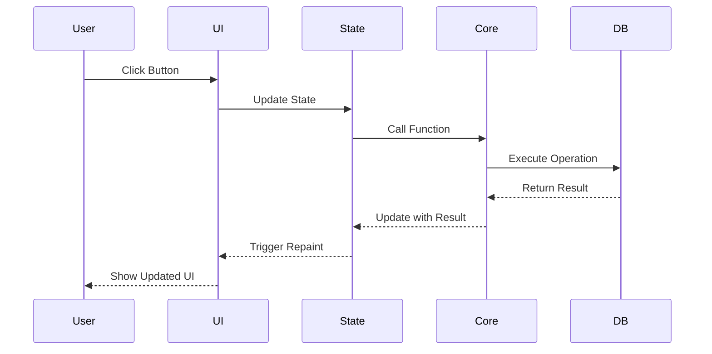

# UI Components Guide

This document details the UI components in Leaf and how they interact with the core functionality.

## UI Architecture Overview



## Main Application State (`src/app/state.rs`)

```rust
pub struct LeafApp {
    // Core database
    database: Option<Arc<Database>>,
    
    // UI Components
    home_screen: HomeScreen,
    sidebar: Sidebar,
    query_windows: Vec<QueryWindow>,
    
    // Dialogs
    csv_import_dialog: CsvImportDialog,
    time_bin_dialog: TimeBinDialog,
    computed_columns_dialog: ComputedColumnsDialog,
    enhanced_grouping_dialog: EnhancedGroupingDialog,
    
    // State
    show_sidebar: bool,
}
```

### Application Loop

```rust
impl eframe::App for LeafApp {
    fn update(&mut self, ctx: &egui::Context, _frame: &mut eframe::Frame) {
        // Top panel with menu
        egui::TopBottomPanel::top("top_panel").show(ctx, |ui| {
            self.show_menu_bar(ui);
        });
        
        // Optional sidebar
        if self.show_sidebar {
            egui::SidePanel::left("sidebar").show(ctx, |ui| {
                self.sidebar.show(ui, &self.database);
            });
        }
        
        // Central panel with home screen
        egui::CentralPanel::default().show(ctx, |ui| {
            self.home_screen.show(ui, &mut self.database);
        });
        
        // Show dialogs
        self.show_dialogs(ctx);
        
        // Show query windows
        self.show_query_windows(ctx);
    }
}
```

## Home Screen (`src/ui/home_screen.rs`)

The main interface showing tables and actions:



### Table Display

```rust
fn show_table_card(&mut self, ui: &mut egui::Ui, table_info: &TableInfo) {
    ui.group(|ui| {
        ui.heading(&table_info.name);
        
        // Table stats
        ui.label(format!("Rows: {}", table_info.row_count));
        ui.label(format!("Columns: {}", table_info.columns.len()));
        
        // Actions
        ui.horizontal(|ui| {
            if ui.button("View Data").clicked() {
                self.open_query_window(table_info.name.clone());
            }
            
            if ui.button("Transform").clicked() {
                ui.menu_button("Transform", |ui| {
                    if ui.button("Add Time Bins").clicked() {
                        self.time_bin_dialog.open();
                    }
                    if ui.button("Add Computed Columns").clicked() {
                        self.computed_columns_dialog.open();
                    }
                    // ... other transformations
                });
            }
        });
    });
}
```

## Dialog Components

### Common Dialog Pattern

All dialogs follow a similar structure:

```rust
pub struct DialogName {
    // Visibility
    is_open: bool,
    
    // Configuration
    selected_table: String,
    selected_column: String,
    parameters: DialogParameters,
    
    // Results
    preview: Option<PreviewData>,
    error: Option<String>,
    
    // Output
    output_name: String,
    output_filename: Option<String>,
}

impl DialogName {
    pub fn show(&mut self, ctx: &egui::Context, database: Arc<Database>) {
        let mut open = self.is_open;
        
        egui::Window::new("Dialog Title")
            .open(&mut open)
            .default_size([600.0, 400.0])
            .show(ctx, |ui| {
                self.show_content(ui, database);
            });
        
        self.is_open = open;
    }
}
```

### Time Bin Dialog Flow



### Dialog UI Components

#### Table Selection

```rust
ui.horizontal(|ui| {
    ui.label("Select table:");
    egui::ComboBox::from_label("")
        .selected_text(&self.selected_table)
        .show_ui(ui, |ui| {
            for table in &available_tables {
                ui.selectable_value(
                    &mut self.selected_table,
                    table.clone(),
                    table
                );
            }
        });
});
```

#### Column Selection with Type Filtering

```rust
// Filter columns by type
let suitable_columns: Vec<_> = columns.iter()
    .zip(types.iter())
    .filter(|(_, dtype)| {
        matches!(dtype, 
            DataType::Float64 | 
            DataType::Int64 |
            DataType::Timestamp(_, _)
        )
    })
    .map(|(col, _)| col.clone())
    .collect();
```

#### Preview Display

```rust
if let Some(preview) = &self.preview {
    ui.separator();
    ui.heading("Preview");
    
    egui::ScrollArea::vertical()
        .max_height(200.0)
        .show(ui, |ui| {
            egui::Grid::new("preview_grid")
                .striped(true)
                .show(ui, |ui| {
                    // Headers
                    for header in &preview.headers {
                        ui.strong(header);
                    }
                    ui.end_row();
                    
                    // Data rows
                    for row in &preview.rows {
                        for cell in row {
                            ui.label(cell);
                        }
                        ui.end_row();
                    }
                });
        });
}
```

## Query Window (`src/ui/query_window.rs`)

A complete SQL query interface:



### Query Execution UI

```rust
// Query input area
let response = egui::TextEdit::multiline(&mut self.query)
    .font(egui::TextStyle::Monospace)
    .desired_width(f32::INFINITY)
    .desired_rows(8)
    .show(ui);

// Execute on Ctrl+Enter
if response.response.has_focus() 
    && ui.input(|i| i.key_pressed(egui::Key::Enter) && i.modifiers.ctrl) {
    self.execute_query(db.clone());
}

// Results display
if let Some(results) = &self.result {
    self.show_results_table(ui, results);
    self.show_pagination_controls(ui, db.clone());
}
```

## UI Patterns and Best Practices

### 1. Responsive Layout

```rust
// Adapt to available space
let available_width = ui.available_width();
let num_columns = (available_width / 300.0).floor() as usize;

ui.columns(num_columns, |columns| {
    for (i, table) in tables.iter().enumerate() {
        let col_index = i % num_columns;
        columns[col_index].group(|ui| {
            show_table_card(ui, table);
        });
    }
});
```

### 2. Error Handling

```rust
// Show errors prominently
if let Some(error) = &self.error {
    ui.colored_label(
        egui::Color32::from_rgb(255, 100, 100),
        format!("✗ Error: {}", error)
    );
}

// Disable actions on error
ui.add_enabled_ui(!self.has_error(), |ui| {
    if ui.button("Execute").clicked() {
        self.execute_action();
    }
});
```

### 3. Progress Indication

```rust
if self.is_processing {
    ui.horizontal(|ui| {
        ui.spinner();
        ui.label("Processing...");
    });
    
    // Disable UI during processing
    ui.set_enabled(false);
}
```

### 4. Input Validation

```rust
// Real-time validation
let is_valid = !self.output_name.is_empty() 
    && !self.output_name.contains(' ')
    && !existing_columns.contains(&self.output_name);

// Visual feedback
if !is_valid && !self.output_name.is_empty() {
    ui.colored_label(
        egui::Color32::RED,
        "Invalid column name"
    );
}

// Enable/disable action button
ui.add_enabled(is_valid, egui::Button::new("Apply"));
```

## Theme and Styling (`src/ui/theme.rs`)

```rust
pub fn configure_theme(ctx: &egui::Context) {
    let mut style = (*ctx.style()).clone();
    
    // Dark theme colors
    style.visuals.dark_mode = true;
    style.visuals.override_text_color = Some(Color32::from_gray(190));
    style.visuals.widgets.noninteractive.bg_fill = Color32::from_gray(27);
    
    // Spacing
    style.spacing.item_spacing = egui::vec2(8.0, 4.0);
    style.spacing.button_padding = egui::vec2(8.0, 4.0);
    
    ctx.set_style(style);
}
```

## Event Handling

### User Actions Flow



## Best Practices Summary

1. **State Management**: Keep UI state separate from business logic
2. **Error Display**: Always show clear error messages to users
3. **Loading States**: Indicate when operations are in progress
4. **Validation**: Validate inputs before allowing actions
5. **Responsiveness**: Use `ui.ctx().request_repaint()` for updates
6. **Memory**: Clean up large data structures when dialogs close
7. **Accessibility**: Provide keyboard shortcuts and clear labels